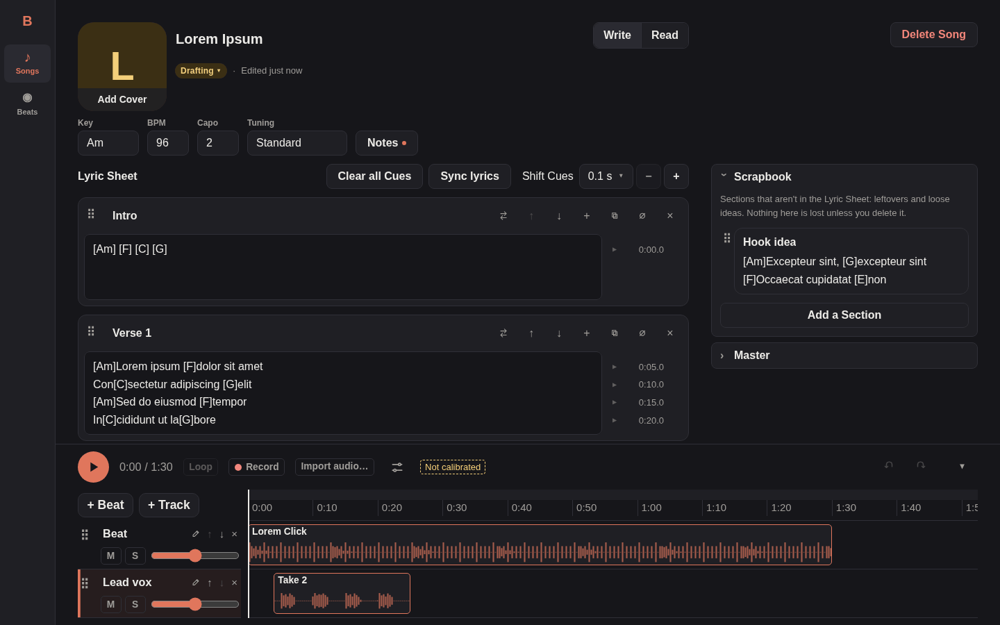
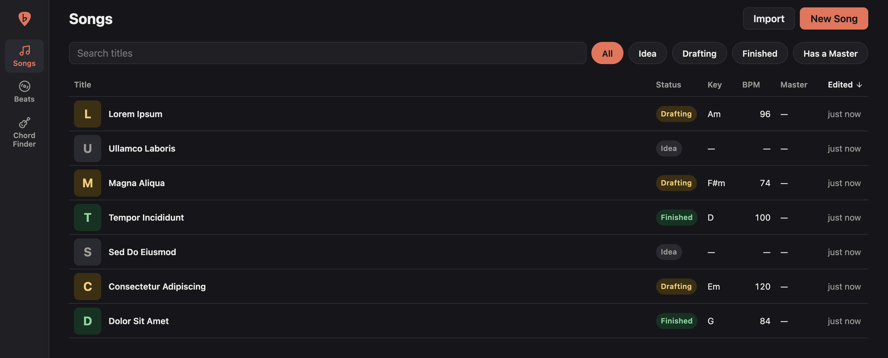
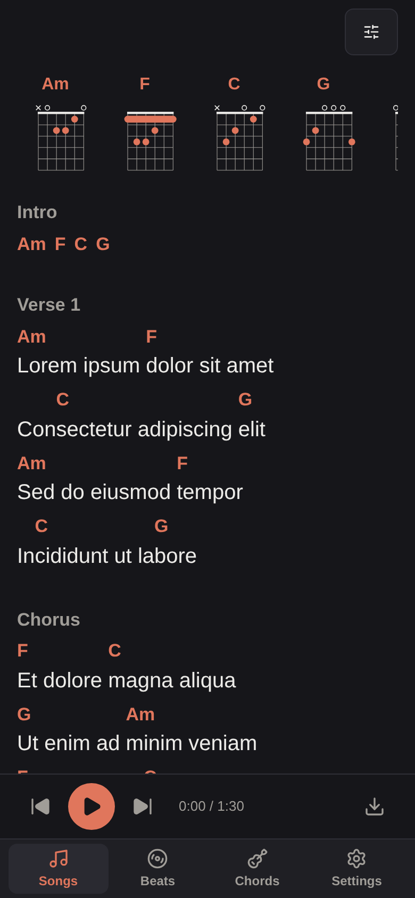
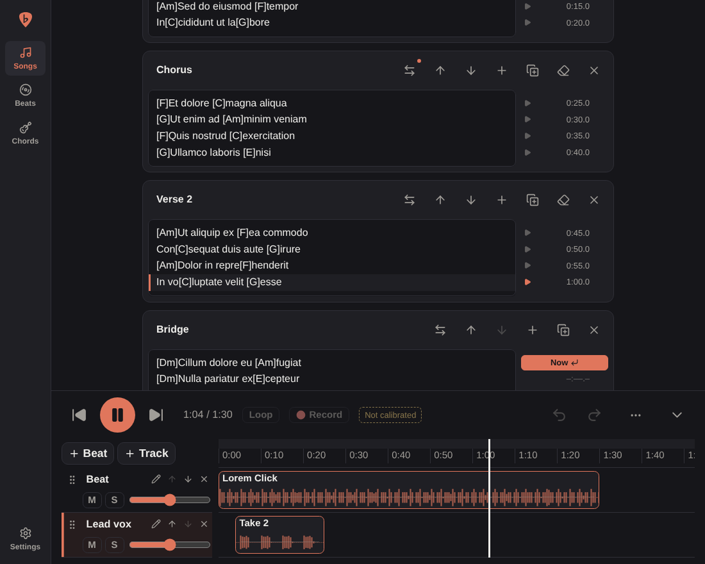
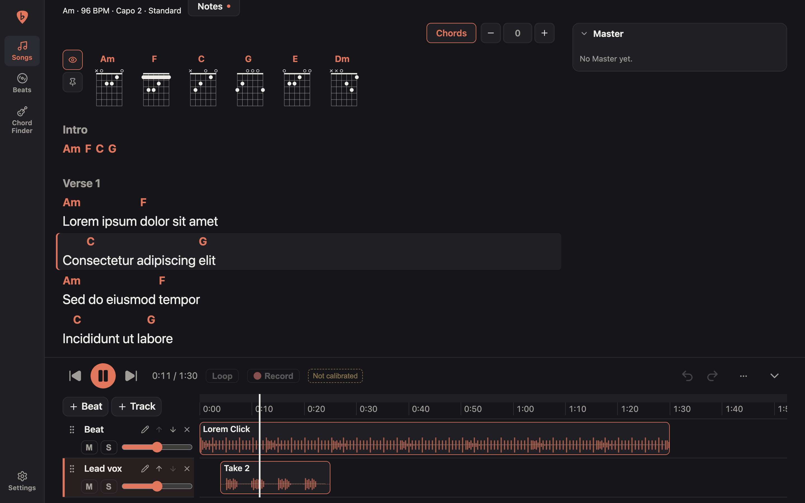

# Bandmate

A personal songwriting companion: write and structure lyrics with chords, then record vocal takes over uploaded beats and line them up on a timeline to iterate on a song. You host it yourself, for yourself.

[](https://github.com/xKirtle/bandmate/actions/workflows/ci.yml)
[](https://github.com/xKirtle/bandmate/releases/latest)
[](LICENSE)



## Features

The words in bold are defined in the [glossary](GLOSSARY.md).

### Write

- **Songs**, each with a **Status** (idea, drafting or finished), a **Cover**, and Details: key, BPM, capo, tuning and notes.
- A **Lyric Sheet** made of **Sections**, each with a free-text **Label** ("Chorus", "Verse 2", "Hook"), put in order by the **Arrangement**. **Duplicate** a Section to sing it again.
- **Alternates**: competing versions of a Section's Lines, one active at a time, all shown in full in **Alternates mode** to choose between.
- **Chords** anchored anywhere in a **Line**, even mid-word, and **Chord Lines** for intros, solos and other instrumental passages.
- A **Scrapbook** for Sections that aren't in the Arrangement: leftovers and loose ideas kept for later.
- Paste-import of plain text or ChordPro, which never guesses or drops what you paste.
- **Write mode** for working on a Song and **Read mode** for playing from it. Finished Songs open in Read mode.
- A two-column Song page on desktop, and a layout for writing lyrics on a phone.





### Listen

- **Masters**: finished recordings of a Song made elsewhere, attached to it with their own waveform and player.
- A **Beat Library** of uploaded **Beats**, shared across Songs, each carrying its credit (producer, source link).
- A **Timeline** per Song, with **Tracks** holding **Clips** of Beats or **Sounds** (audio imported into one Song). Clips are trimmed without touching the file.
- Each Track has its own volume, mute and solo. A **Loop** repeats a stretch of the Timeline.
- Undo and redo for every Timeline edit.

### Sync

- **Cues** link Lines to times on the Timeline. Make them in **Sync mode**, marking each Line "Now" as it starts, or type them in the Cue gutter.
- While the Timeline plays, the Line playing is highlighted and the Lyric Sheet follows it. In Read mode, clicking a cued Line plays from it.
- Shift every Cue at once, and see which Cues are out of order.





### Record

- **Takes** recorded in the browser as lossless WAV, on the **Chosen Track**, over whatever the Timeline holds.
- Retake a Clip to stack Takes in it, then choose the one it plays.
- **Latency Offset** calibration per device, by tapping or clapping along with a click, and a **Nudge** per Take for the rest.
- An **Input** picker with a level meter, remembered per device.

## Roadmap

What might come next, from **Snapshots** of the Lyric Sheet to rebinding **Shortcuts**, is in [docs/roadmap.md](docs/roadmap.md), along with what's been decided for each. What each version shipped is in its [release notes](https://github.com/xKirtle/bandmate/releases).

## Quickstart

Releases are published as images to `ghcr.io/xkirtle/bandmate`. Create a `data` folder owned by the user the container runs as, then start it with Docker Compose, using the repo's [`compose.yaml`](compose.yaml):

```yaml
services:
  bandmate:
    image: ${BANDMATE_IMAGE:-ghcr.io/xkirtle/bandmate:latest}
    container_name: bandmate
    restart: unless-stopped
    # Run as the owner of ./data so the bind-mounted folder stays writable.
    user: "${PUID:-1000}:${PGID:-1000}"
    ports:
      - "${BANDMATE_PORT:-8080}:8080"
    volumes:
      - ./data:/data
    healthcheck:
      test: ["CMD", "/bandmate", "healthcheck"]
      interval: 30s
      timeout: 5s
      start_period: 10s
      retries: 3
```

```sh
mkdir data
docker compose up -d
```

Or with `docker run`:

```sh
docker run -d --name bandmate --restart unless-stopped \
  --user 1000:1000 \
  -p 8080:8080 \
  -v "$PWD/data:/data" \
  ghcr.io/xkirtle/bandmate:latest
```

Bandmate is then on http://localhost:8080. Before using it anywhere beyond your own machine, read [Security](#security).

## Configuration

The Compose file reads these variables (put them in a `.env` next to it):

| Variable         | Default                           | Purpose                                          |
| ---------------- | --------------------------------- | ------------------------------------------------ |
| `BANDMATE_PORT`  | `8080`                            | Host port                                        |
| `BANDMATE_IMAGE` | `ghcr.io/xkirtle/bandmate:latest` | Image to run                                     |
| `PUID` / `PGID`  | `1000`                            | User the container runs as. It must own `./data` |

Bandmate itself reads these:

| Variable                 | Default  | Purpose                                                                                                                    |
| ------------------------ | -------- | -------------------------------------------------------------------------------------------------------------------------- |
| `BANDMATE_ADDR`          | `:8080`  | Listen address                                                                                                             |
| `BANDMATE_DATA_DIR`      | `./data` | Directory holding the SQLite database (`bandmate.db`), audio files (`audio/`), Covers (`covers/`) and Backups (`backups/`) |
| `BANDMATE_MAX_UPLOAD_MB` | `500`    | Largest audio file accepted for upload, in megabytes                                                                       |
| `BANDMATE_UPDATE_CHECK`  | `on`     | `off` stops the About tab asking GitHub for the latest release and the release notes. It's Bandmate's only outbound call   |

The image sets `BANDMATE_DATA_DIR` to `/data`, the folder the examples above mount.

`GET /api/health` returns `200 {"status":"ok"}` when the database is reachable. `bandmate healthcheck` calls it and exits non-zero on failure. The container healthcheck uses it because the image has no shell or curl.

## Security

Bandmate has no login, so anything that can reach it can read and change every Song. Anywhere beyond your own machine, put it behind a reverse proxy that handles HTTPS and authentication, and let only the proxy reach it. Browsers also only allow the microphone, which recording needs, over HTTPS or on localhost.

To report a vulnerability, and for what counts as one, see [SECURITY.md](SECURITY.md).

## Upgrading, rolling back and backups

Each release is published under these tags:

| Tag            | What it is                                                                            |
| -------------- | ------------------------------------------------------------------------------------- |
| `:X.Y.Z`       | One release, e.g. `:0.4.0`. It never changes.                                         |
| `:X.Y`         | The newest patch release of that version, e.g. `:0.4`: fixes and small features only. |
| `:latest`      | The newest release.                                                                   |
| `:edge`        | The latest build of `main`, ahead of any release. Expect it to change without notice. |
| `:sha-<short>` | One build of `main`, by its commit, e.g. `:sha-1a2b3c4`.                              |

A release with new features bumps the minor version, and one with only fixes bumps the patch, as [CONTRIBUTING.md](CONTRIBUTING.md#versions) describes. Pin `:X.Y` to get fixes without new features, or `:X.Y.Z` to change only when you choose. Set the tag with `BANDMATE_IMAGE`, e.g. `BANDMATE_IMAGE=ghcr.io/xkirtle/bandmate:0.4`.

**Upgrading:** pull the new image and recreate the container (`docker compose pull && docker compose up -d`). Database migrations are built into the binary and run automatically on startup.

**Rolling back:** run an older version tag instead. Migrations only go forward, so an older version doesn't undo a newer one's changes to the database. If the release you're leaving changed the database, put back the copy of the `data` folder you took before upgrading along with the older tag.

**Backups:** the Backups tab, in Settings, makes a Backup of the Songs you choose, the whole Beat Library, or both, and keeps it in Bandmate. Download a Backup as one file to keep elsewhere, and upload it to this install or another. A Restore brings back what you pick from a Backup. Where the same Song or Beat is already in Bandmate, even from another install, you choose to replace it or keep both, and nothing the Backup doesn't hold is deleted. A newer Bandmate restores an older one's Backups, never the other way round.

**Copying the data folder:** the low-level option. Stop Bandmate, so the database isn't mid-write, and copy the `data` folder. It holds the database, every audio file, every Cover and every Backup, so the copy holds everything. Copy it before each upgrade: rolling back needs the folder as it was before the new version's migrations changed it.

## How it's built

Bandmate is one Go binary. It serves a JSON API under `/api`, stores everything in SQLite and audio files in the data folder, and serves the Svelte single-page app from files built into the binary ([ADR 0001](docs/adr/0001-go-backend-svelte-spa.md)). Recording, waveforms and the Timeline's playback all run in the browser. It has no login: authentication is the reverse proxy's job ([ADR 0002](docs/adr/0002-single-user-auth-at-proxy.md)).

The design is worked out in words before code. [GLOSSARY.md](GLOSSARY.md) is the glossary: the code, the UI and the issues all use its terms. The decisions that shaped it, and why, are the [ADRs](docs/adr/).

## Contributing

Bug reports and ideas are welcome. See [CONTRIBUTING.md](CONTRIBUTING.md) for how to contribute, and for building, testing and releasing Bandmate, and the [Code of Conduct](CODE_OF_CONDUCT.md) for how we treat each other.

## License

Bandmate is licensed under the [GNU Affero General Public License v3.0](LICENSE). If you run a modified Bandmate as a service that others use over a network, you must offer them the source code of your modified version.
